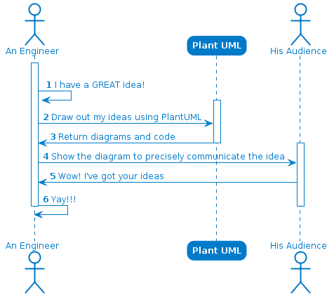

For a software engineer, sequence diagrams come up as a *boring* technology. This is partly because sequence diagrams were sometimes the unwanted requirement of the homework deliverables while we were in college.

However, as I got more matured with the discipline, I found that this is the one piece of technology that should be taught and utilized more widely. We have all seen a case where someone fails to explain his good idea to the group because nobody is able to follow his thought when he explains it with words. _**Protip: Don’t be that person**_

The key to growing as a software engineer is the ability to communicate your ideas and plans to your team/supervisors effectively. As one said, _**"one look is worth a thousand words"**_. Don’t take my words for it, see for yourself the better steps toward making yourself heard. 💡



Why do we even bother with PlantUML? Can't we just use draw.io for this task?

It is because we'd like to be able to modify this file quickly with code. The file above was generated using this code

```plantuml
@startuml

!includeurl https://cdn.jsdelivr.net/gh/HSLdevcom/hsl-plantuml-theme/hsl-theme.iuml

actor "An Engineer" as A
participant "Plant UML" as P
actor "His Audience" as H

autonumber
|||
activate A
A -> A: I have a GREAT idea!
activate P
A -> P: Draw out my ideas using PlantUML
P -> A: Return diagrams and code
deactivate P

activate H
A -> H: Show the diagram to precisely communicate the idea

H -> A: Wow! I've got your ideas
A -> A: Yay!!!
deactivate A
deactivate H
|||

@enduml
```

You can follow this link to the [playground](https://www.planttext.com/?text=JP7BQiCm44Nt-efnDbqbtdjHOcYe0YcOfALqgKg3FKKFeuU38HzVMKcQxYJDlMVkZBOX2X-JqOnLPALE2fFNCCGuXgQkfRARdw1Gq-Gt5cFT3pK_7HHEqfbw27ezQc4N_peEQB0ybTE62bJ8w3oiMWixsvD5z2iG0LesvhOaQSnkM7KB13xU3gNOtLsSiZ8fGYknL7W6fkXiCj_esULoMPGqYOYPsCBw6Te6zZ282K70wt7NlWCf5DL3rrrrNGClNfp1fGXcBg80AP3jeOJ9MLXt0nun9cz1aUYzC064LI2TGfPD3-oZ1R-su0sS1dU6l8wx5wA3qQEaW7hE36EI9Rbu5j4IWZ5-w_hfpXNid_8alOimk-IlAV_c_19pLLN_GxJ_BxpiXstHgl8Jx1S0)

By now, if you are like me, you will realize that you can quickly update the above diagram if needed and you can put this code in version control along with many other things. 😍

Beside sequence diagrams, the tool can even generate other types of diagrams such as state diagram, class diagram, component diagram… So next time, when you have your next meeting, don’t miss out on utilizing this tool. I guarantee you it will immediately increase your productivity. 👌
